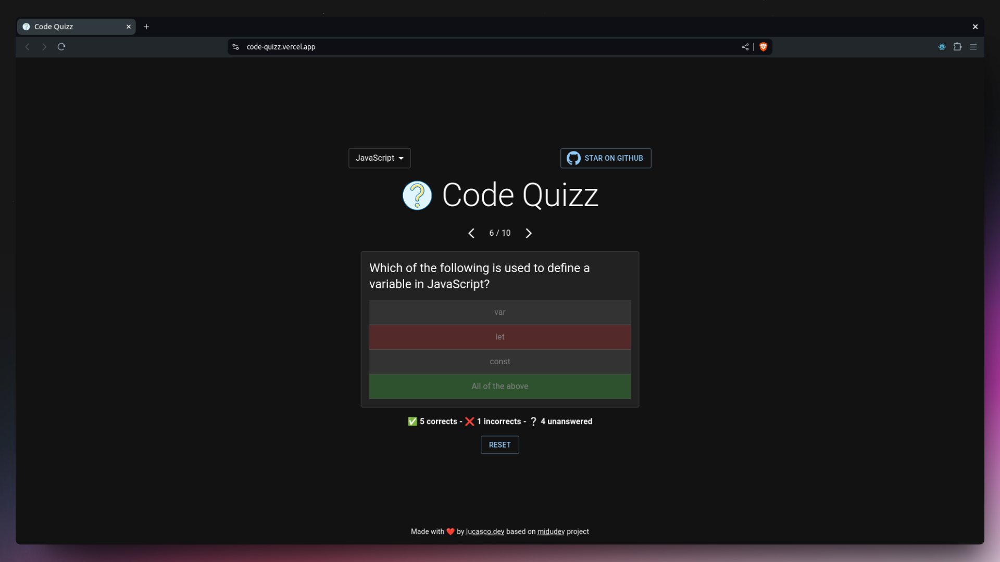

# Code Quizz



## Description

Code Quizz is an interactive web application that allows users to answer code-related questions in various programming languages, based on [this midudev video](https://www.youtube.com/watch?v=p2wF2wRjcN0). The application utilizes React, TypeScript, Vite for fast development, Zustand for state management, and Material UI (MUI) for a polished user interface.

## Features

- **Multi-language Support**: Questions available in JavaScript and Dart (more coming soon).
- **State Management**: Zustand for simple and effective state management.
- **Modern UI**: Designed with Material UI for an attractive user experience.
- **Real-time Results**: Instant feedback on user answers.

## Technologies Used

- [React](https://reactjs.org/) - JavaScript library for building user interfaces.
- [TypeScript](https://www.typescriptlang.org/) - Superset of JavaScript adding static types.
- [Vite](https://vitejs.dev/) - Fast frontend development tool.
- [Zustand](https://zustand-demo.pmnd.rs/) - State management for React.
- [Material UI](https://mui.com/) - React components library for UI.
- [Canvas Confetti](https://www.kirilv.com/canvas-confetti/) - Confetti effects for celebrations.

## Installation

Follow these steps to set up the project on your local machine:

1. Clone the repository:

  ```bash
  git clone https://github.com/isaias-alt/code-quizz.git
  cd code-quizz
  ```

2. Install dependencies:

  ```bash
  # Install pnpm globally if you don't have it:
  npm install -g pnpm

  # and install dependencies:
  pnpm install
  ```

3. Start the development server:

  ```bash
  pnpm run dev
  ```

## Available Scripts

- `pnpm run dev`: Starts the development server.
- `pnpm run build`: Builds the app for production.
- `pnpm run lint`: Runs TypeScript and React code linter.
- `pnpm run preview`: Previews the built app.

## Project Structure

```plaintext
code-quizz/
├── public/
│    ├── dart.json
│    ├── icon.svg
│    └── javascript.tsx
├── src/
│   ├── components/
│   │   ├── Game.tsx
│   │   ├── Header.tsx
│   │   ├── Question.tsx
│   │   ├── Results.tsx
│   │   ├── Start.tsx
│   │   └── icons/
│   │       └── CodeQuizzIcon.tsx
│   │       └── GitHubIcon.tsx
│   │       └── JavaScriptIcon.tsx
│   ├── hooks/
│   │   └── useQuestionsData.ts
│   ├── services/
│   │   └── questions.ts
│   ├── store/
│   │   └── questions.ts
│   ├── utils/
│   │   └── colorUtils.ts
│   ├── App.tsx
│   ├── main.tsx
│   └── index.css
├── package.json
├── tsconfig.json
└── vite.config.ts
```

## Contribution

Contributions are welcome! If you have any ideas or find any bugs, please open an [issue](https://github.com/isaias-alt/code-quizz/issues) or submit a [pull request](https://github.com/isaias-alt/code-quizz/pulls).

## License

This project is licensed under the MIT License. See the [LICENSE](./LICENSE) file for more details.

## Contact

- Author: Lucas Casco
- GitHub: [isaias-alt](https://github.com/isaias-alt/)
- Website: [lucasco.dev](https://lucasco.dev)
- Email: [cascolucasisaias@gmail.com](mailto:cascolucasisaias@gmail.com)
- Twitter: [lucascodev](https://twitter.com/lucascodev)

---

Enjoy using Code Quizz and enhance your programming skills!

[](https://github.com/isaias-alt/code-quizz)
